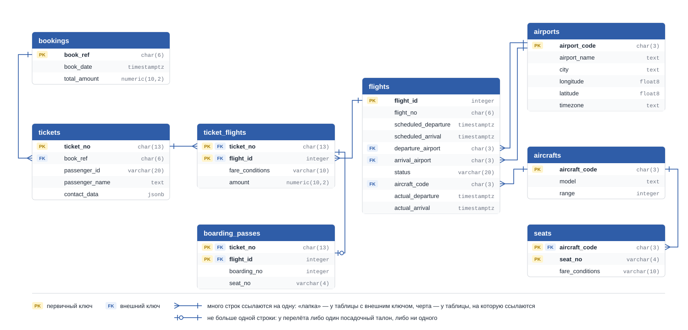

# Схема демобазы авиаперевозок

Все восемь таблиц лежат в схеме `bookings`, в запросах имя пишется вместе со схемой:
`bookings.flights`. Схема построена по самой базе: столбцы, типы и ключи — такие же, какие вы
увидите в DBeaver.

## Как читать схему

- **Блок** — таблица, строки внутри — её столбцы: слева пометка ключа и имя, справа тип.
- **PK** — первичный ключ: по нему строка отличается от остальных. Если пометка PK стоит
  у нескольких столбцов, ключ составной: уникальна их комбинация, а не каждый по отдельности.
- **FK** — внешний ключ: значение этого столбца обязано существовать в другой таблице.
- **Линия** идёт от столбца с внешним ключом к столбцу, на который он ссылается. «Лапка» стоит
  у таблицы, где строк много, черта — у таблицы, где строка одна. Например, `tickets → bookings`:
  у билета ровно одно бронирование, в бронировании может быть много билетов.
- **Две линии от `flights` к `airports`**: у рейса два аэропорта — вылета и прилёта, и каждый
  столбец ссылается на `airports` отдельно.
- **Линия от `boarding_passes` к `ticket_flights`** соединяет сразу пару столбцов
  (`ticket_no`, `flight_id`): внешний ключ составной.
- Все столбцы обязательные (`NOT NULL`), кроме трёх: `tickets.contact_data`,
  `flights.actual_departure` и `flights.actual_arrival`.

Типы на схеме записаны коротко: `char(3)` — это `character(3)`, `varchar` — `character varying`,
`timestamptz` — `timestamp with time zone`, `float8` — `double precision`.

## Что означает одна строка

| Таблица | Одна строка — это | Строк |
|---|---|---|
| `bookings.bookings` | бронирование: одна покупка, в которой один или несколько билетов | 262 788 |
| `bookings.tickets` | билет одного пассажира | 366 733 |
| `bookings.ticket_flights` | перелёт по билету на конкретном рейсе: в билете с пересадкой их несколько | 1 045 726 |
| `bookings.boarding_passes` | посадочный талон: выдаётся при регистрации на рейс, поэтому есть не у каждого перелёта | 579 686 |
| `bookings.flights` | рейс в конкретный день: рейс `PG0405` за разные дни — разные строки | 33 121 |
| `bookings.airports` | аэропорт | 104 |
| `bookings.aircrafts` | модель самолёта (не отдельный борт) | 9 |
| `bookings.seats` | место в салоне модели самолёта | 1 339 |

## Что лежит в столбцах

| Таблица | Столбец | Что в нём |
|---|---|---|
| `bookings` | `book_ref` | номер бронирования |
| | `book_date` | когда оформлено |
| | `total_amount` | полная стоимость всех билетов бронирования |
| `tickets` | `ticket_no` | номер билета |
| | `book_ref` | бронирование, в которое входит билет |
| | `passenger_id` | номер документа пассажира |
| | `passenger_name` | имя и фамилия заглавными буквами |
| | `contact_data` | телефон и email, может быть `NULL` |
| `ticket_flights` | `ticket_no`, `flight_id` | билет и рейс |
| | `fare_conditions` | класс обслуживания |
| | `amount` | стоимость этого перелёта |
| `boarding_passes` | `ticket_no`, `flight_id` | билет и рейс |
| | `boarding_no` | номер посадочного талона на рейсе |
| | `seat_no` | место в салоне |
| `flights` | `flight_id` | номер строки рейса |
| | `flight_no` | номер рейса, например `PG0405` |
| | `scheduled_departure`, `scheduled_arrival` | вылет и прилёт по расписанию |
| | `departure_airport`, `arrival_airport` | аэропорты вылета и прилёта |
| | `status` | статус рейса |
| | `aircraft_code` | модель самолёта |
| | `actual_departure`, `actual_arrival` | фактические вылет и прилёт, могут быть `NULL` |
| `airports` | `airport_code` | код аэропорта из трёх букв |
| | `airport_name`, `city` | название и город |
| | `longitude`, `latitude` | долгота и широта |
| | `timezone` | часовой пояс аэропорта |
| `aircrafts` | `aircraft_code` | код модели |
| | `model` | название модели |
| | `range` | дальность полёта, км |
| `seats` | `aircraft_code`, `seat_no` | модель самолёта и номер места |
| | `fare_conditions` | класс обслуживания |

## Значения, которые стоит знать

- **`flights.status`** — `Scheduled` (продажа открыта), `On Time` (регистрация открыта, вылет вовремя),
  `Delayed` (вылет задержан), `Departed` (в воздухе), `Arrived` (прилетел), `Cancelled` (отменён).
- **`fare_conditions`** — `Economy`, `Comfort`, `Business`.
- **`tickets.contact_data`** — контакты пассажира в формате JSON: `{"email": "…", "phone": "…"}`.
  Поле достаётся так: `contact_data->>'email'`.
- Данные сформированы на момент **13.10.2016 17:00**: рейсы после этого момента ещё не состоялись.

Кроме таблиц, в схеме `bookings` есть два готовых представления — `flights_v` и `routes` (рейсы
и маршруты с названиями городов и аэропортов) — и функция `bookings.now()`, которая возвращает
момент, на который сформированы данные. Подробное описание — на сайте Postgres Pro:
<https://postgrespro.ru/education/demodb>.
